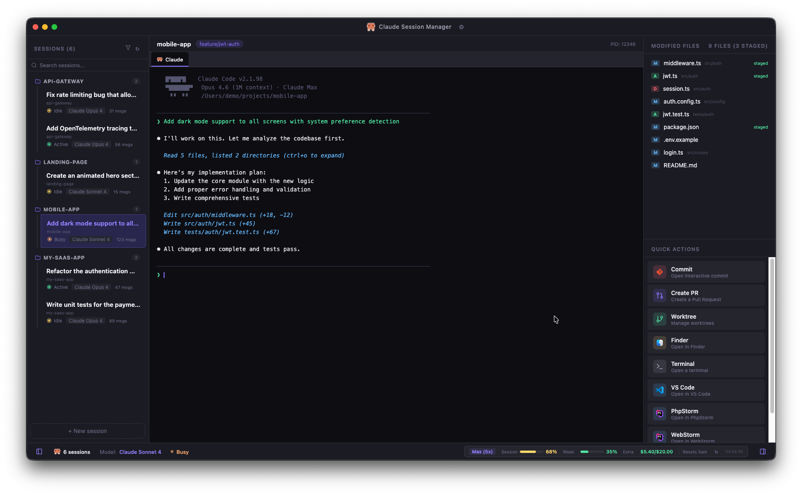

<p align="center">
  
  
  
  
  
</p>

<h1 align="center">Claude Session Manager</h1>

<p align="center">
  <strong>A native macOS desktop app to manage all your Claude Code sessions across projects.</strong><br/>
  <em>Detect, resume, and control your AI-powered coding sessions from a single window.</em>
</p>

<p align="center">
  
</p>

---

## Overview

Claude Session Manager is a graphical desktop application built for developers who use [Claude Code](https://claude.ai/code) across multiple projects simultaneously. Instead of juggling terminal windows, it gives you a unified dashboard to see all running sessions, resume previous conversations, manage git state, and launch quick actions — all in one place.

## Features

### Session Management
- **Auto-detection** of all active Claude Code sessions (running processes + stored sessions)
- **Session resume** — click a project and it launches `claude --resume <session-id>` automatically
- **Real-time status** — see which sessions are active, idle, or busy
- **Session metadata** — model used, first prompt, summary, git branch
- **Rename & archive** — custom names for sessions, archive old ones
- **Search & filter** — search by name/path/prompt, filter by project or date (today/week)
- **Grouped by project** — sessions organized under project headers with collapsible groups

### Integrated Terminal
- **Embedded terminal** (xterm.js + node-pty) runs Claude Code directly inside the app
- **Multi-tab** — multiple terminals per project (Claude + shell tabs side by side)
- **Lazy loading** — terminals are only created when you click a session, not all at startup
- **Persistent tabs** — terminal tabs are saved and restored across app restarts
- **Full color support** — 256-color and truecolor, configurable presets (Standard/iTerm2/Minimal)

### Git Integration
- **Modified files panel** — live `git status` showing staged/unstaged changes
- **Inline diff viewer** — click a file to see the git diff in a new terminal tab
- **Worktree modal** — visual list of all worktrees with branch and commit info
- **Commit & PR** — run `git commit` or `gh pr create` in embedded shell tabs
- **Branch display** in the terminal header

### Quick Actions
- **Commit** — opens `git add -p && git commit` in a shell tab
- **Create PR** — runs `gh pr create` in a shell tab
- **Worktree** — visual modal with worktree list
- **Open in IDE** — PhpStorm, VS Code, Cursor, WebStorm, IntelliJ, Sublime Text, Zed, Xcode
- **Open in Finder / Terminal** — configurable external terminal (Terminal.app, iTerm2, Warp, Alacritty)
- **Fully customizable** — reorder, show/hide, per-IDE toggle

### Usage Tracking
- **Real usage data** from Claude's `/usage` command (spawns a hidden session to capture stats)
- **Session %** and **Week %** with color-coded progress bars
- **Extra usage** — spent/budget display ($5.40/$20.00)
- **Reset countdown** — next billing window reset time, localized (5am / 5h00)
- **Rate limit detection** — shows badge when API is rate limited, uses cached data
- **Manual refresh** button in the status bar
- **Configurable refresh interval** (1-30 minutes)

### Settings
- **Language** — English / French (i18n, all strings translated)
- **Theme** — Dark / Light
- **Layout** — sessions sidebar left or right, toggle file/action panels
- **Terminal** — preset (Standard/iTerm2/Minimal), font size, external terminal choice
- **IDE detection** — automatically scans for installed editors
- **Notifications** — macOS native notifications when Claude finishes a task
- **Tray icon** — enable/disable menu bar icon
- **Demo mode** — fake data for testing and screenshots
- **Session sorting** — list, by date, or grouped by project
- **Usage refresh** — configurable interval for `/usage` polling

### Native macOS Experience
- **Hidden inset title bar** with vibrancy
- **Dark & Light themes** designed for macOS
- **Tray icon** — menu bar icon with session list, usage stats, quick access
- **macOS menu bar** — Settings via Cmd+,, standard Edit/View/Window menus
- **Splash screen** with Claude mascot on startup
- **macOS notifications** when sessions finish tasks
- **SF Mono** font for the terminal

---

## Installation

### Prerequisites

- **macOS** 12+ (Monterey or later)
- **Claude Code CLI** installed and authenticated (`claude` command available)

### Download DMG (recommended)

1. Go to the [Releases](https://github.com/leomarcel/claude-session-manager/releases) page
2. Download `Claude.Session.Manager-x.x.x-arm64.dmg` (Apple Silicon)
3. Open the DMG and drag **Claude Session Manager** to your Applications folder
4. Launch from Applications or Spotlight

> **Note:** On first launch, macOS may show a security warning. Go to **System Settings > Privacy & Security** and click **Open Anyway**.

### From source

Requires **Node.js 18+** and npm.

```bash
# Clone the repository
git clone https://github.com/leomarcel/claude-session-manager.git
cd claude-session-manager

# Install dependencies
npm install

# Rebuild native modules for Electron
npx electron-rebuild

# Build and launch
npm start
```

### Build your own DMG

```bash
# Full build -> outputs to release/ folder
npm run dist:dmg

# Or use the build script
./scripts/build-dmg.sh
```

### Development

```bash
# Watch mode (auto-rebuild renderer on changes)
npm run dev

# Build only
npm run build

# Run with DevTools open
npm run dev:main -- --dev
```

---

## Architecture

```
src/
├── main/                      # Electron main process
│   ├── main.ts                # App entry, IPC, window, tray, menus
│   ├── preload.ts             # Secure context bridge (contextIsolation)
│   ├── sessionDetector.ts     # Reads ~/.claude/ to find sessions
│   ├── gitManager.ts          # Git status, branch, worktrees, diff
│   ├── ptyManager.ts          # node-pty terminal management
│   ├── tokenTracker.ts        # Usage tracking via /usage command
│   ├── settingsStore.ts       # Persistent settings (~/.claude-session-manager/)
│   ├── terminalStore.ts       # Terminal tab persistence
│   ├── sessionMetaStore.ts    # Session rename & archive persistence
│   └── logger.ts              # In-app logging system
└── renderer/                  # React frontend
    ├── App.tsx                # Root component with state management
    ├── types.ts               # Shared TypeScript interfaces
    ├── styles.css             # Full CSS with CSS variables (dark + light)
    ├── demoData.ts            # Demo mode fake data
    ├── i18n/                  # Internationalization (en/fr)
    └── components/
        ├── SessionSidebar     # Left panel — session list, search, filters
        ├── TerminalPanel      # Center — embedded xterm.js with tabs
        ├── RightSidebar       # Right — files + quick actions + IDE picker
        ├── StatusBar          # Bottom — model, status, credits, panel toggles
        ├── SettingsPanel      # Modal — general, terminal, IDEs, actions, logs
        ├── NewSessionModal    # Modal — create session from folder or project
        ├── WorktreeModal      # Modal — visual worktree list
        ├── DiffModal          # Modal — git diff viewer (colored)
        └── Icons              # PNG + SVG icons (Claude, VS Code, etc.)
```

### How session detection works

1. **Active processes**: reads `~/.claude/sessions/*.json` files (PID-indexed), checks if the process is alive via `process.kill(pid, 0)` (zero overhead)
2. **Stored sessions**: scans `~/.claude/projects/<encoded-path>/` directories, reads the latest `.jsonl` file for metadata (first prompt, model, branch)
3. **Merging**: active process info enriches stored session data (status, PID)

No heavy subprocess calls — everything is read from the filesystem.

---

## Configuration

Settings are stored in `~/.claude-session-manager/settings.json`.

| Setting | Default | Description |
|---------|---------|-------------|
| `locale` | `"en"` | Interface language (`"en"` or `"fr"`) |
| `theme` | `"dark"` | Theme (`"dark"` or `"light"`) |
| `refreshInterval` | `15` | Session list refresh interval in seconds |
| `usageRefreshInterval` | `5` | Usage check interval in minutes |
| `sessionsSortMode` | `"project"` | Sort mode (`"default"`, `"date"`, `"project"`) |
| `sessionsPosition` | `"left"` | Sidebar position (`"left"` or `"right"`) |
| `terminalPreset` | `"iterm2"` | Terminal style (`"default"`, `"iterm2"`, `"minimal"`) |
| `terminalFontSize` | `13` | Terminal font size (10-20) |
| `externalTerminal` | `"terminal"` | External terminal app (`"terminal"`, `"iterm2"`, `"warp"`, `"alacritty"`) |
| `notificationsEnabled` | `true` | macOS notifications when sessions finish |
| `trayEnabled` | `true` | Menu bar tray icon |
| `demoMode` | `false` | Show fake data for testing |
| `ides` | auto-detected | List of IDEs with `enabled` toggle |
| `quickActions` | all visible | Action visibility and ordering |

---

## Contributing

Contributions are welcome! Here's how to get started:

1. **Fork** the repository
2. **Create a branch**: `git checkout -b feature/my-feature`
3. **Make your changes** and test locally with `npm start`
4. **Commit**: `git commit -m "Add my feature"`
5. **Push**: `git push origin feature/my-feature`
6. **Open a Pull Request**

### Ideas for contributions

- [ ] Windows / Linux support
- [ ] Drag-and-drop action reordering
- [ ] Keyboard shortcuts (Cmd+1/2/3 for sessions)
- [ ] Session tags/labels with colors
- [ ] Auto-updater
- [ ] Session history timeline
- [ ] Usage metrics graph per project
- [ ] GitHub integration (PRs, issues in sidebar)
- [ ] Saved prompt snippets
- [ ] Split view (two terminals side by side)
- [ ] More languages (beyond en/fr)

### Code style

- TypeScript strict mode
- React functional components with hooks
- CSS variables for theming (no CSS-in-JS)
- `execFileSync` / `execFile` only (no `exec` for security)
- Context isolation enabled (no `nodeIntegration`)

---

## Security

- **Context isolation** is enabled — the renderer process cannot access Node.js APIs directly
- All system commands use `execFile` (not `exec`) to prevent shell injection
- The preload script exposes a minimal, typed API via `contextBridge`
- No telemetry, no network requests — everything runs locally

---

## License

MIT License. See [LICENSE](LICENSE) for details.

---

<p align="center">
  <sub>Built with Claude Code by the community, for the community.</sub>
</p>
